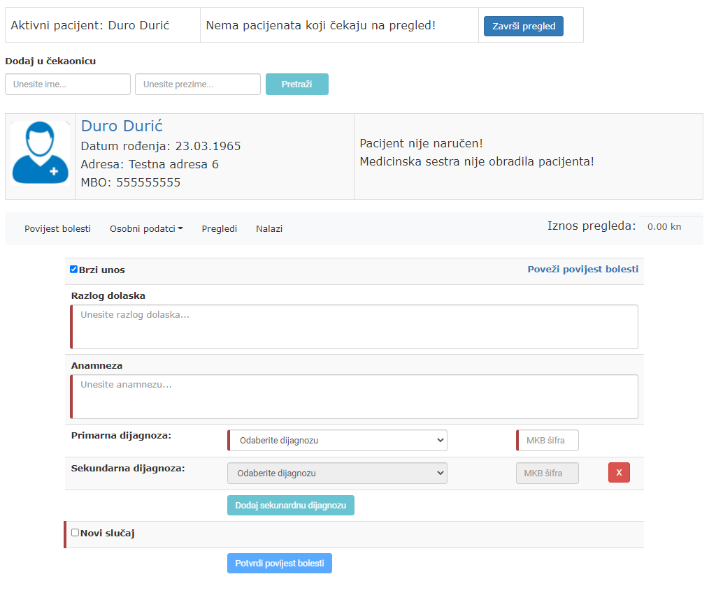
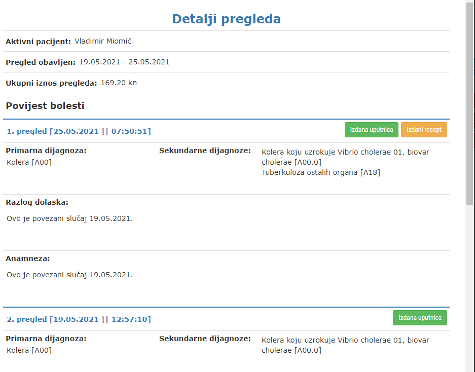

# Ordinacija opće/obiteljske medicine

### Popis korištenih kratica
1. OM - Opća/obiteljska medicina
2. HZZO - Hrvatski zavod za zdravstveno osiguranje

### Opis
Aplikacija ordinacije OM je Web aplikacija koja predstavlja uvid u informatički dio posla kojim se bave zdravstveni radnici u ordinacijama OM. Kreirana web aplikacija nije kompletno programsko rješenje koje bih se moglo koristiti u praksi, ali predstavlja jako dobar temelj koji bih se u slučaju nadogradnje, mogao implementirati u poslovnom svijetu.
Glavne uloge (korisnici) ove aplikacije su liječnik (specijalist obiteljske medicine) te medicinska sestra.
Aplikacija je sastavljena na način da se korisnicima omogući pregledno korisničko sučelje, brz dolazak do željenih informacija te pristup najnovijim verzijama šifrarnika HZZO-a.

### Korištene tehnologije
* Angular
* TypeScript
* PHP
* MySQL

### Glavne funkcionalnosti
1. Obrada
2. Čekaonica
3. Evidencija osobnih podataka pacijenata
4. Povezivanje prethodnih pregleda
5. Izdavanje, ažuriranje te prikaz recepata
6. Izdavanje uputnice
7. Naručivanje pacijenata
8. Prikaz prethodnih pregleda
9. Prikaz detalja završenog pregleda

### Pregled funkcionalnosti
* ### Obrada pacijenta

* ### Čekaonica

* ### Zdravstveni podatci pacijenta

* ### Povezivanje prethodnih pregleda

* ### Izdavanje recepta

* ### Ažuriranje recepta

* ### Prikaz recepta

* ### Izdavanje uputnice

* ### Naručivanje pacijenata

* ### Prikaz prethodnih pregleda

* ### Prikaz detalja završenog pregleda

